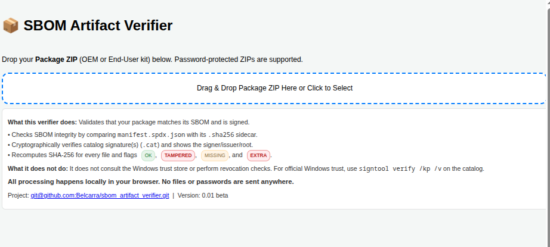
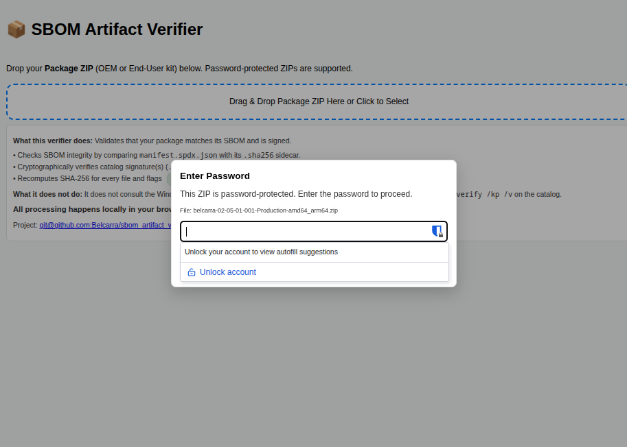
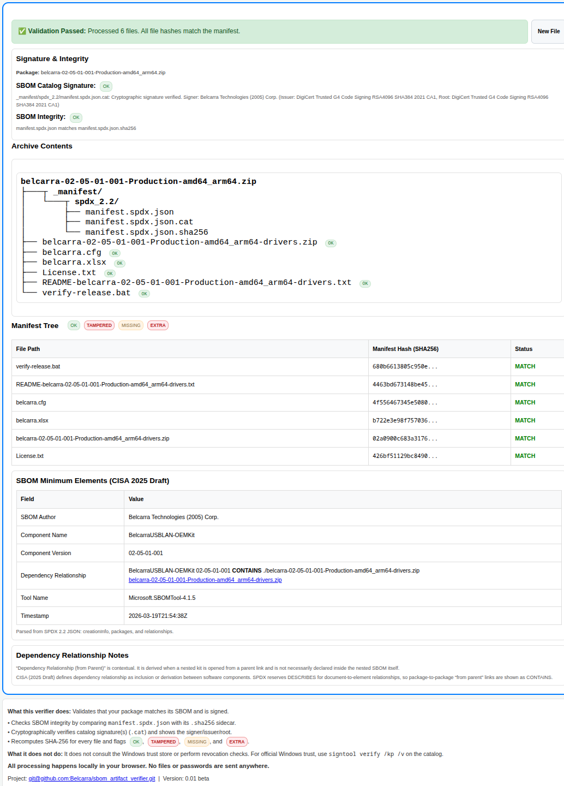
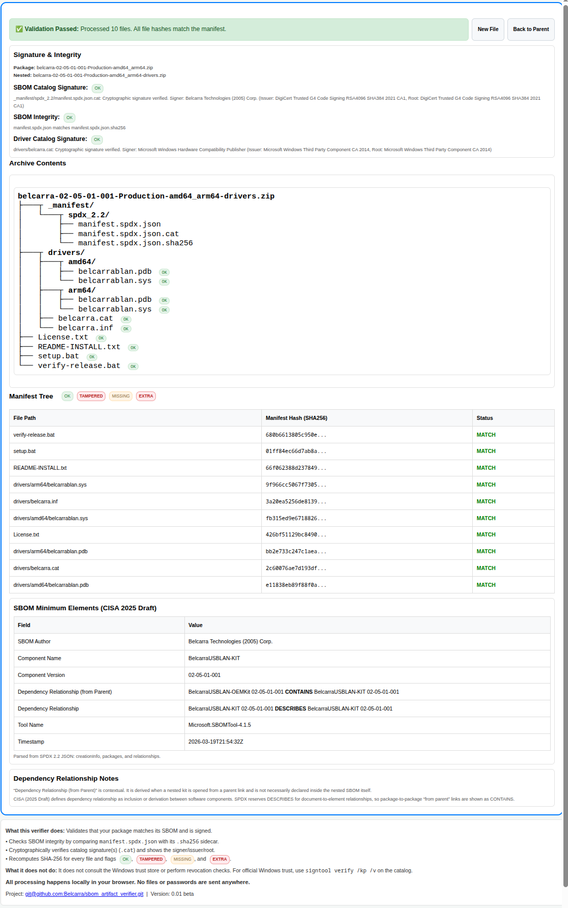

# Belcarra SPDX SBOM Overview

[Open the verifier](../spdxsbom.html)  
[Download the PDF version](./Belcarra-SPDX-SBOM.pdf)

Belcarra's OEM Driver Kits now include an SPDX SBOM to satisfy the NTIA Executive Order 14028.

## Description

Belcarra licences a *Windows 11 NDIS/USB Filter Driver* to OEMs, allowing them to distribute the driver to their customers to use with their hardware. The driver kit is branded with the OEM's name, customized with the Vendor and Product IDs that their device(s) use.

Both kits include an SPDX SBOM manifest, in JSON format, that describes the contents of the kit. The manifest is generated using the Microsoft sbom-tool, version 4.1.5, and conforms to the SPDX 2.2 specification. The manifest is signed with Belcarra's EV Code Signing Certificate signature, and includes a SHA256 hash of the manifest file for integrity verification.

## Belcarra SBOM Verifier

Belcarra makes available a browser-based SBOM verifier that can be used to verify the manifest included in the kits.

To use the Belcarra SBOM verifier open this URL: [Verifier URL](https://verifier.belcarra.com/spdxsbom.html)

The verifier will:
- unpack the kit,
- extract the manifest,
- verify the manifest's integrity using the SHA256 hash,
- verify the manifest's signature using WebCrypto and PKI.js,
- if there is a driver catalog file it will verify the package catalog signature,
- display the results along with the SPDX SBOM manifest details.

## Verification Layers

The Belcarra packaging and verification flow uses four distinct verification layers:

1. `manifest.spdx.json.cat`
   Belcarra signs the Windows catalog for the SBOM manifest artifacts.
2. `manifest.spdx.json.sha256`
   `sbom-tool` generates the SHA-256 sidecar for `manifest.spdx.json`.
3. `manifest.spdx.json`
   The SBOM lists hashes for the kit contents, and the verifier recomputes those hashes for the described files outside `_manifest`.
4. Driver catalog, e.g. `belcarra.cat`
   In the end-user kit, the Microsoft-signed driver catalog provides the Windows driver-package signature path for the installable payload.

## End-User Kit

The end-user kit, a zip file, contains the driver files, installation instructions, and license. Two bat scripts are provided:

- `setup.bat`: uses the Microsoft `pnputil` utility to install the driver on the end-user's system.
- `verify-release.bat`: uses the Microsoft `sbom-tool-x64.exe` to verify the SPDX SBOM `_manifest` included in the kit.

```text
belcarra-02-05-01-001-Production-amd64_arm64-drivers.zip
├───┬ _manifest/
│   └───┬ spdx_2.2/
│       ├── manifest.spdx.json
│       ├── manifest.spdx.json.cat
│       └── manifest.spdx.json.sha256
├───┬ drivers/
│   ├───┬ amd64/
│   │   ├── belcarrablan.pdb
│   │   └── belcarrablan.sys
│   ├───┬ arm64/
│   │   ├── belcarrablan.pdb
│   │   └── belcarrablan.sys
│   ├── belcarra.cat
│   └── belcarra.inf
├── License.txt
├── README-INSTALL.txt
├── setup.bat
└── verify-release.bat
```

- [_manifest/spdx_2.2/manifest.spdx.json](./kit/_manifest/spdx_2.2/manifest.spdx.json) is the SPDX SBOM for the end-user kit.
- [report-kit.json](./report-kit.json) is the `sbom-tool` verification report for the end-user kit.

| Field | Value |
| ---- | ----- |
| SBOM Author | Belcarra Technologies (2005) Corp. |
| Component Name | BelcarraDemoUSBLAN |
| Component Version | 02-05-01-001 |
| Dependency Relationship | BelcarraDemoUSBLAN 02-05-01-001 DESCRIBES BelcarraDemoUSBLAN 02-05-01-001 |
| Tool Name | Microsoft.SBOMTool-4.1.5 |
| Timestamp | 2026-02-13T07:43:32Z |

### Dependency Relationship

The end-user kit manifest describes the relationship between the SPDX document and the end-user package. When the kit is opened standalone, the verifier shows the nested package as self-described by its SPDX document.

## OEM Kit

The OEM kit, a password-protected zip file, contains a README, the cfg files used to configure the release package, the end-user kit zip file, and a single bat script:

- `verify-release.bat`: uses the Microsoft `sbom-tool-x64.exe` to verify the SPDX SBOM `_manifest` included in the end-user kit zip file.

```text
belcarra-02-05-01-001-Production-amd64_arm64.zip
├───┬ _manifest/
│   └───┬ spdx_2.2/
│       ├── manifest.spdx.json
│       ├── manifest.spdx.json.cat
│       └── manifest.spdx.json.sha256
├── belcarra-02-05-01-001-Production-amd64_arm64-drivers.zip
├── belcarra.cfg
├── belcarra.xlsx
├── License.txt
├── README-belcarra-02-05-01-001-Production-amd64_arm64-drivers.txt
└── verify-release.bat
```

- [_manifest/spdx_2.2/manifest.spdx.json](./oem/_manifest/spdx_2.2/manifest.spdx.json) is the SPDX SBOM for the OEM kit.
- [report-oem.json](./report-oem.json) is the `sbom-tool` verification report for the OEM kit.

### Dependency Relationship

The OEM kit manifest describes the relationship between the OEM kit and the end-user kit, indicating that the OEM kit contains the end-user kit zip file as a component. The verifier carries that parent-child context into the nested view when you open the embedded end-user kit from the OEM kit report.

### SBOM Minimum Elements (CISA 2025 Draft)

| Field | Value |
| ---- | ----- |
| SBOM Author | Belcarra Technologies (2005) Corp. |
| Component Name | belcarra |
| Component Version | 02-05-01-001 |
| Dependency Relationship | belcarra 02-05-01-001 CONTAINS ./belcarra-02-05-01-001-Production-amd64_arm64-drivers.zip |
| Tool Name | Microsoft.SBOMTool-4.1.5 |
| Timestamp | 2026-02-13T07:43:37Z |

## Screenshots

Drag and drop the OEM kit zip file onto the webpage. You may be prompted for a password.

This verifies the manifest included in the OEM kit.

### Dependency Relationship Verification

The OEM kit contains the end-user kit as a component. The verifier shows the OEM kit as the parent component, and the end-user kit as a child component. You can click on the end-user kit name to open the end-user kit zip file and verify the manifest included in the end-user kit.

### Belcarra Verifier Opening and Password




### OEM Kit Verification screenshot



### End-User Kit Verification screenshot



## Reports

- [report-oem.json](./report-oem.json) is the `sbom-tool` verification report for the OEM kit.
- [report-kit.json](./report-kit.json) is the `sbom-tool` verification report for the end-user kit.
